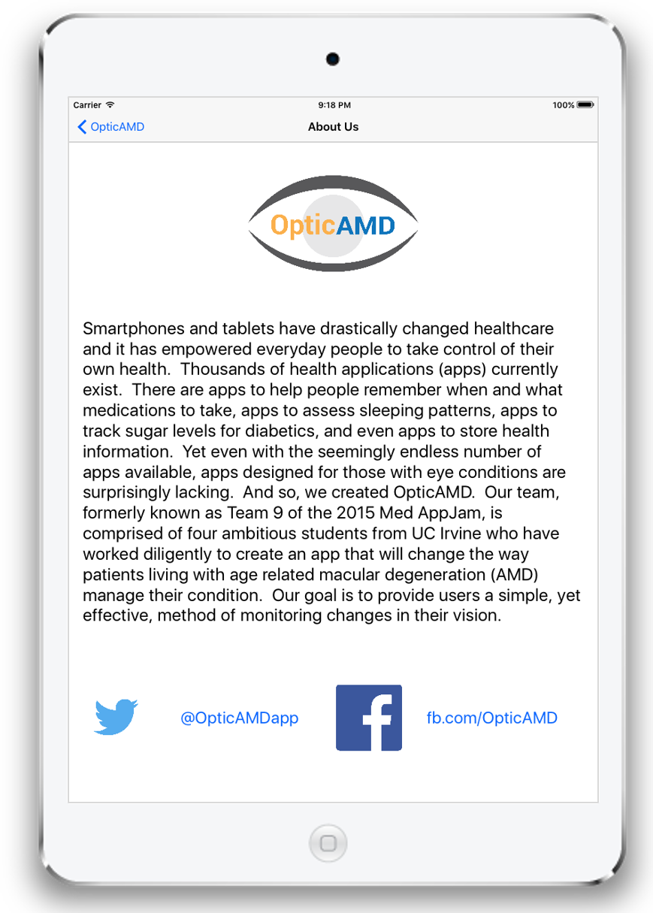

## OpticAMD
<h6>
Med AppJam 
University of California, Irvine 
Fall Quarter, 2015
</h6>

* * *

### Introduction

**Description** This is an app my team and I wrote for UC Irvine’s Fall 2015 Med AppJam – an intense two-week competition in which small teams produce a medically themed iOS app.
* As our team leader, I pushed the project forward, and we ultimately created OpticAmd an iOS app which allows people suffering from age-related macular degeneration (AMD) to track their central vision degradation by marking different types of central distortions on an Amsler grid.
* We programmed the app in Swift using the Xcode IDE and used git for version control.
* The app utilized dynamic graphic drawing, implemented image analysis to calculate distortion areas, and a custom data structure to save data persistently to the device.
* The app displayed saved data in a table view and utilized the iOS Charts library to display distortion area trend.
* In addition to my leadership role, I programmed the majority of the app, and designed the UI and all branding elements (logo, app icon, color scheme).

* * *

### Flow Diagram

* * *

### App Demo Video on YouTube

* * *

### Screenshots

#### Title Page

#### Taking a Test

#### Viewing Previous Tests

#### Viewing Trend Data

#### About Us Page

* * *

### Group Members
|Group Member | Role|
|---|---|
Brian Chipman | Programmer, Team Leader
Victor Nie | Programmer
Alex Soh | Programmer
Thomas Vo | Medical Student
